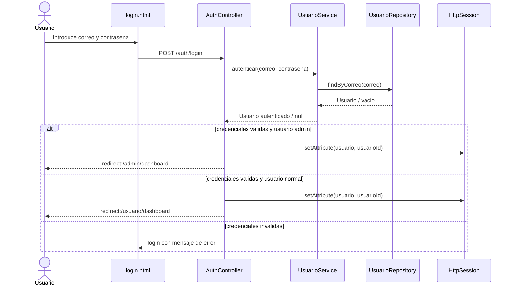
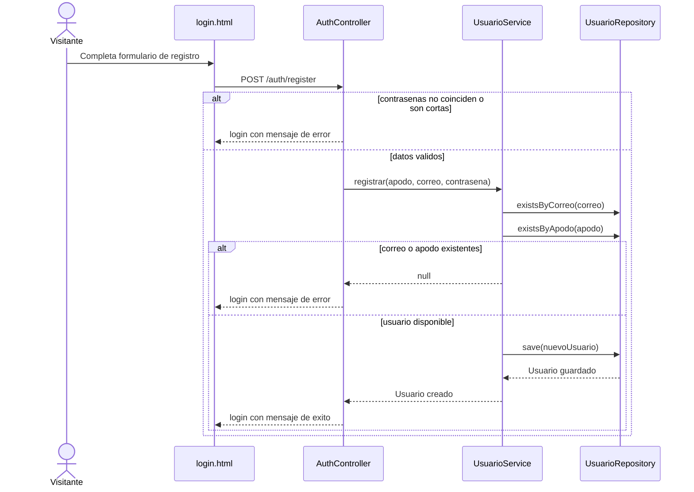
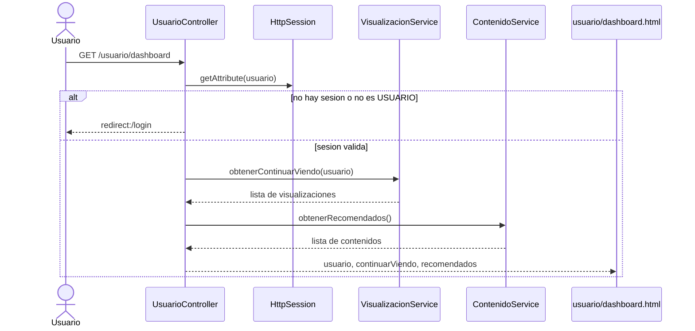
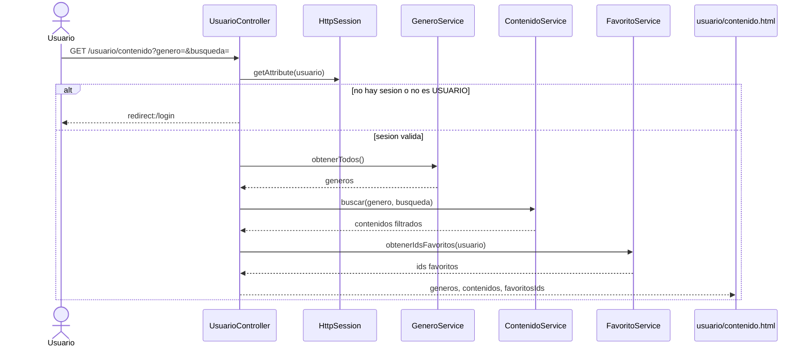
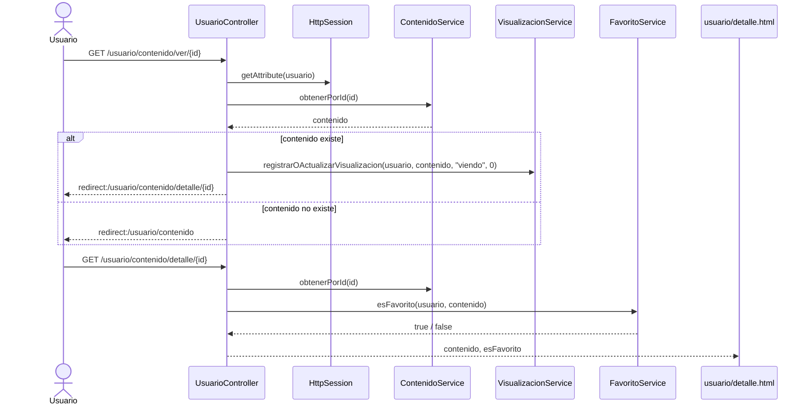
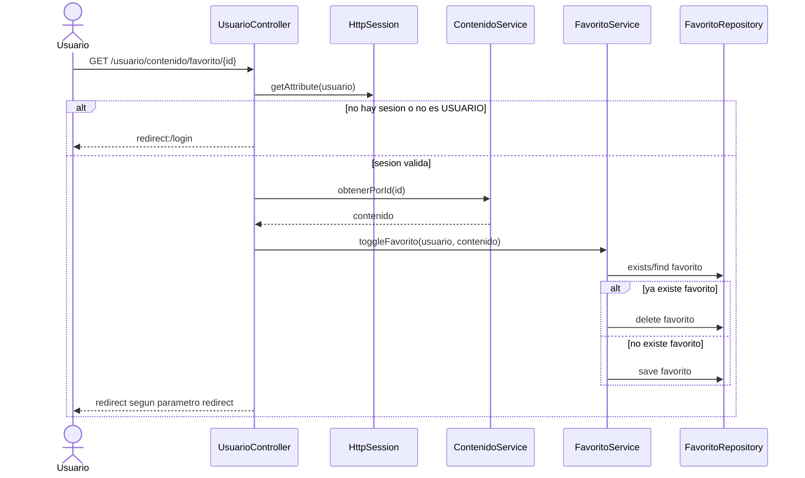
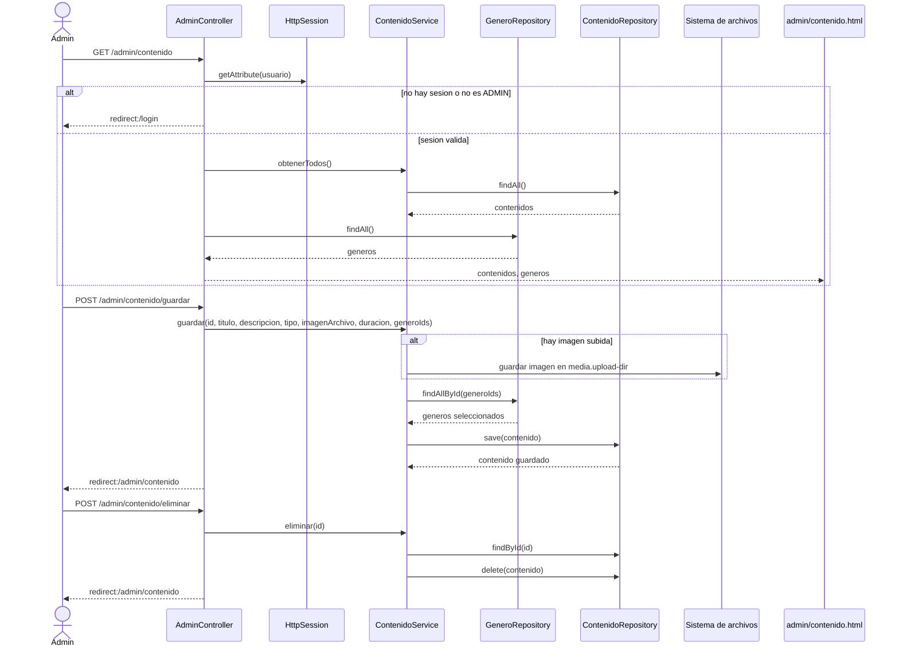
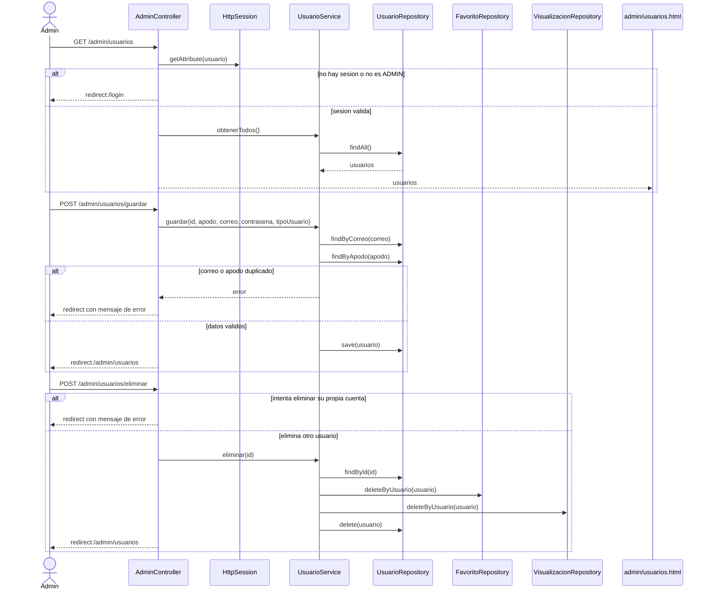
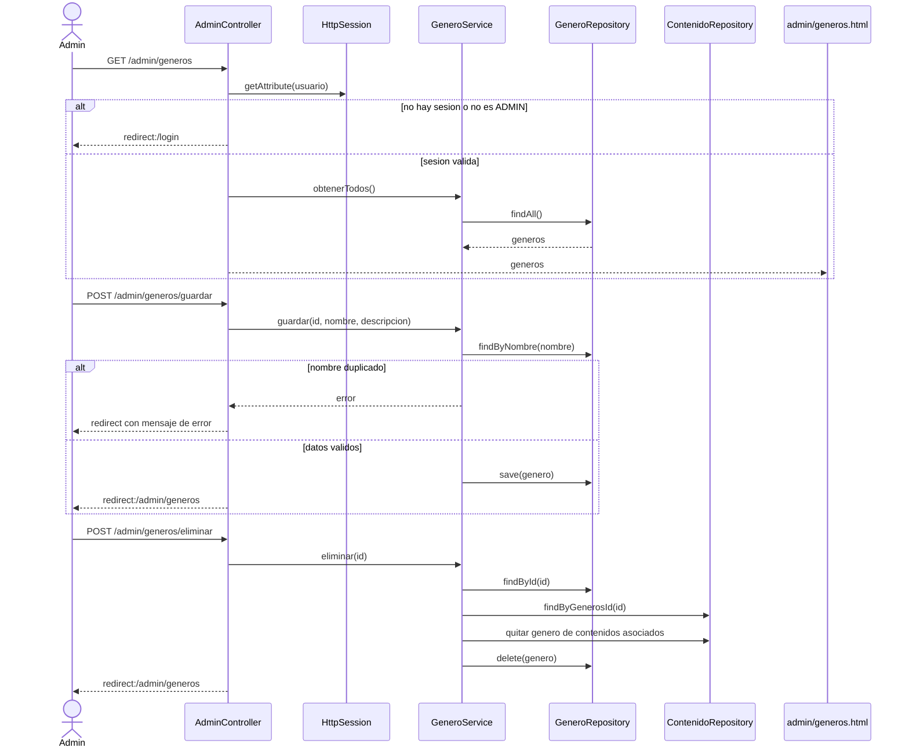
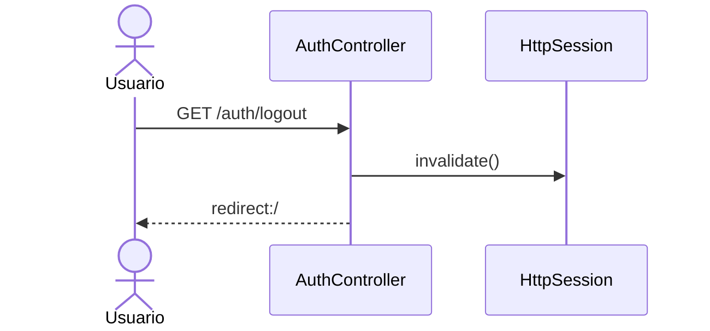

# Diagramas de secuencia - MediaStreaming

## 1. Inicio de sesion

## 2. Registro de usuario

## 3. Dashboard de usuario

## 4. Explorar y filtrar contenido

## 5. Ver detalle de contenido

## 6. Agregar o quitar favorito

## 7. CRUD de contenido desde admin

## 8. CRUD de usuarios desde admin

## 9. CRUD de generos desde admin

## 10. Logout

